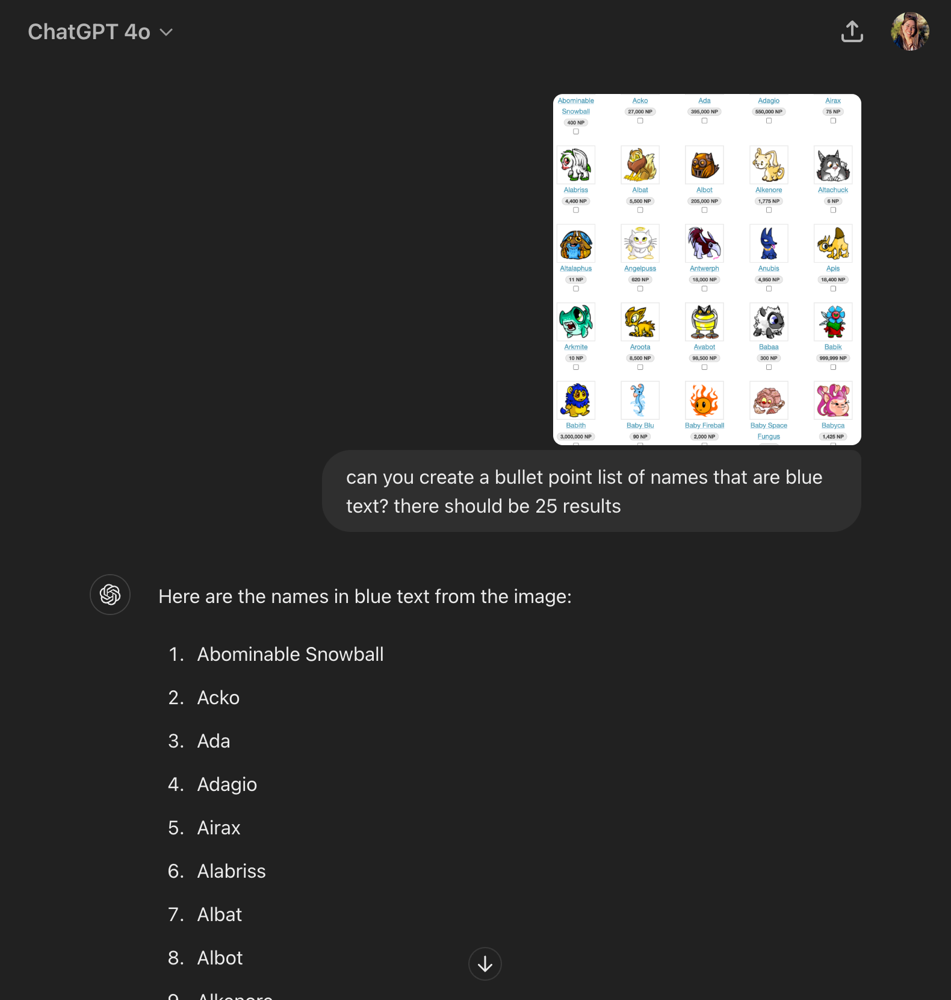

JellyNeo has a really strict scraping policy and as a result doesn't allow scraping

So instead, I took screenshots of the results 25 results at a time using the below link:

https://items.jellyneo.net/search/all-petpets/?limit=25&petpet_colour=1000&start=0

And asked ChatGPT to "can you create a bullet point list of names that are blue text? there should be 25 results" with an included screenshot

I copy and pasted the results to names.txt